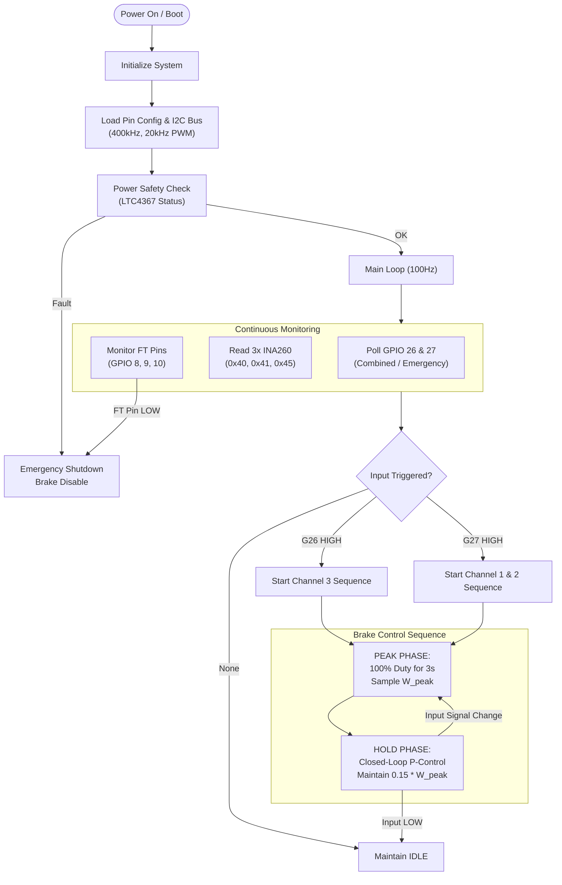

# MP6519 3-Channel Firmware Flowchart

This document outlines the logical flow and multi-channel state machine for the RP2040 firmware.

## 1. Logic Sequence (Per Channel)
1.  **Idle State**: No PWM output. `ENABLE` pin is `LOW`.
2.  **Peak Phase**: 
    - Triggered by respective input.
    - `PWM` set to 100%.
    - `ENABLE` set to `HIGH`.
    - Samples power for 3 seconds.
3.  **Hold Phase**:
    - Calculates target wattage (15% of Peak).
    - Runs a high-frequency control loop (100Hz) adjusting PWM to match target.
4.  **Shutdown**:
    - Triggered if input goes `LOW`.
    - PWM and Enable are immediately disabled.

## 2. Safety Integrations
- **Watchdog**: Hardware watchdog ensures the system restarts if the loop hangs.
- **LTC4367**: Hardware-level protection for over/under voltage.
- **Fault (FT)**: Immediate hardware interrupt if the MP6519 detects a driver-level fault.
