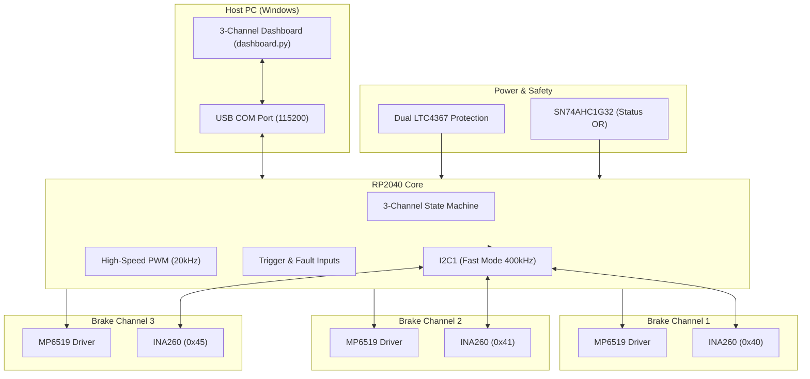

# MP6519 3-Channel Brake Driver System - System Architecture

This document describes the overall system architecture, hardware connections, and data flow for the final production version of the MP6519 3-Channel Brake Driver System.

## 1. System Overview
The system is a high-reliability industrial brake controller based on the **RP2040 MCU**. It manages three independent brake channels with closed-loop power monitoring and multi-stage protection circuitry.

## 2. Hardware Architecture
- **MCU**: RP2040 (Dual ARM Cortex-M0+).
- **Communication**: UART0 for telemetry/commands; I2C1 for power monitoring.
- **Brake Drivers**: 3x MP6519GQ-Z, each with Enable, PWM, Fault, and Mode controls.
- **Monitoring**: 3x INA260AIPWR for high-side current and voltage sensing.
- **Protection**: Dual LTC4367 for over-voltage, under-voltage, and reverse-voltage protection.

## 3. Control Methodology
### 3.1 Trigger Logic
- **Combined Input (GPIO 26)**: Triggers Channel 3 sequence.
- **Emergency Input (GPIO 27)**: Triggers Channel 1 & 2 sequence.

### 3.2 Closed-Loop Operation
Each channel follows a strict 3-phase sequence:
1.  **Peak Phase (3s)**: Applies 100% duty cycle to detect maximum power draw.
2.  **Ramp Phase**: Transitions smoothly to the maintenance power level.
3.  **Hold Phase**: Uses telemetry feedback to maintain exactly **15%** of the measured peak wattage.

## 4. Telemetry & User Interface
The system streams real-time JSON telemetry at 10Hz, providing independent V, I, W, and status for all three channels. The Python Dashboard provides a centralized view for monitoring and testing.
