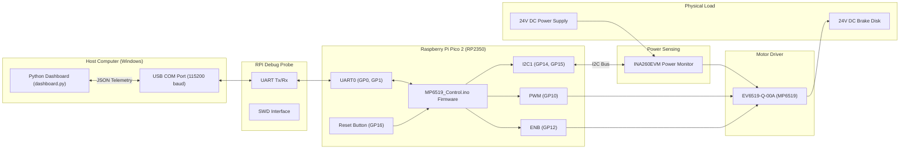

# MP6519 Brake Driver Test Jig - System Architecture

This document describes the overall system architecture, hardware connections, and data flow of the MP6519 Brake Driver Test Jig project.

## 1. System Overview
The system is designed to intelligently apply power to a 24V DC Brake Disk using a closed-loop control system. It features fault detection, precise power management (boost and hold phases), and live telemetry visualization via a Python desktop application.

## 2. Hardware Mapping
*   **RP2350 to INA260**: I2C1 (SCL=GP15, SDA=GP14) with external 10K pull-ups.
*   **RP2350 to MP6519**: EN=GP12, MODE=GP11, PWM=GP10, FT=GP13.
*   **RP2350 to Reset Button**: GP16 (Internal Pull-up, connect to GND to trigger).
*   **RP2350 to PC**: RPI Debugger connected to UART0 (GP0, GP1).

## 3. Data Flow
1.  **Sensing**: The INA260 continuously monitors the high-side 24V supply going into the MP6519 driver.
2.  **Control**: The Pico 2 firmware reads the INA260 at 10Hz. Based on the calculated wattage, it runs a closed-loop controller adjusting the PWM duty cycle on GP10.
3.  **Telemetry**: Every 100ms, the Pico 2 formats a JSON string containing V, I, W, PWM frequency, Duty Cycle, Fault State, and Phase State.
4.  **Visualization**: The Python application reads this JSON string over the Serial COM port, parses it, and dynamically updates the Tkinter UI dashboard.
